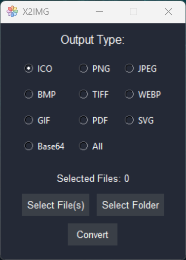

<h1 align="center">
   
  <b>X2IMG 🎨</b>
   
</h1>

X2IMG is a simple image conversion tool that allows you to convert various image formats easily. 

## Features ✨
- Convert images to multiple formats: PNG, JPEG, SVG, GIF, base64, TIFF, and more!
- Supports batch processing of files and folders.
- Easy-to-use graphical interface.

## Usage ⚙️
1. Clone the repository:
   `git clone https://github.com/Denveous/X2IMG.git`
2. Navigate to the project directory:
   `cd X2IMG`
3. Install the required packages:
   `pip install -r requirements.txt`
4. Run the application:
   `python main.py`
5. Select your image files or folder.
6. Choose the output format and click "Convert"! 

## Screenshots 📷

  </a>

## Windows Executable 💻
A precompiled executable for Windows is available for download [here](https://github.com/Denveous/X2IMG/releases/download/Windows/X2IMG.exe) section. You can download the Nuitka EXE from there.

You can find the Virus Total scan [here](https://www.virustotal.com/gui/url-analysis/u-e017fa275cfb80770eeaf05e4723a4d68d4b5d575c725a5ba42479bb1b1d03a8-1743626618).

## Credits 🙌
- This project includes CairoLib from [CairoGraphics](https://cairographics.org/) for rendering and image conversion.

## Contributing 🤝
Feel free to submit pull requests, all contributions are welcome!

## License 📜
This project is licensed under the MIT License.
